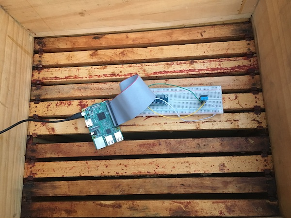
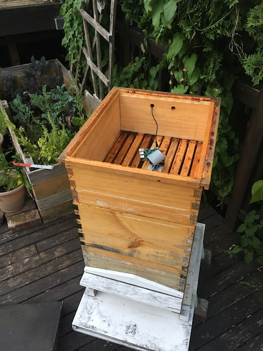
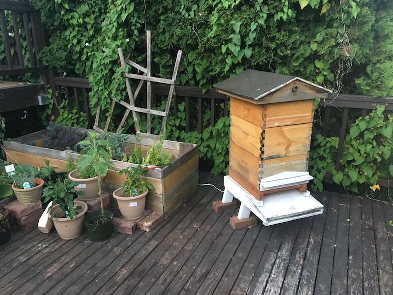
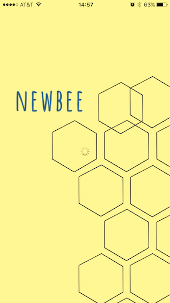
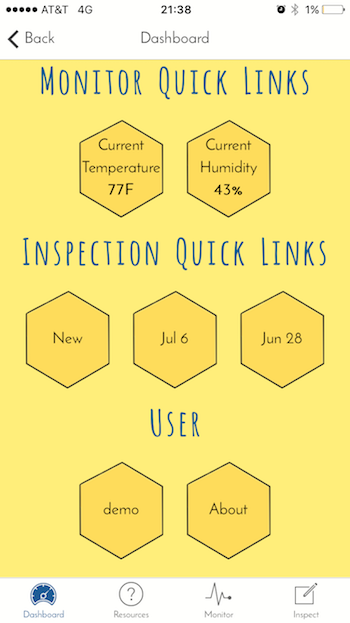
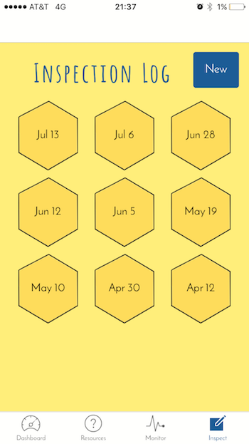
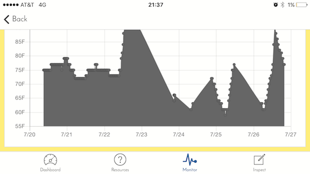
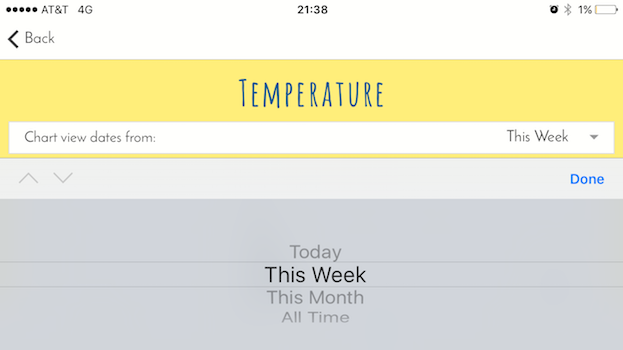
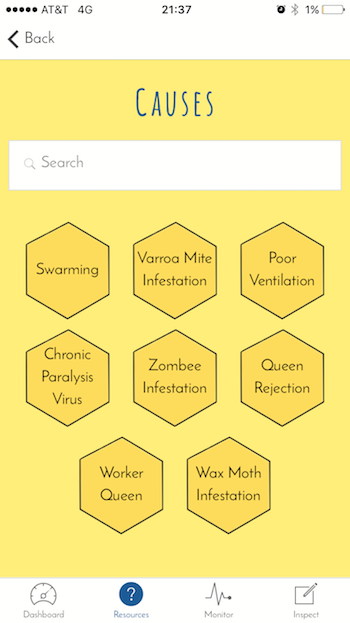
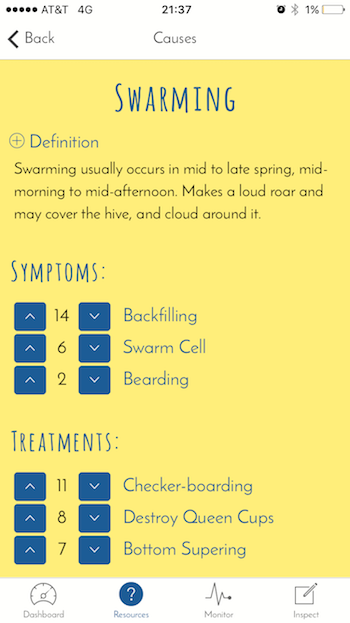

NewBee
===========

NewBee is a mobile app that utilizes Internet of Things (among other things) to aide "newbee" beekeepers understand how to care for their hive.

## Internet of Stings

One way that NewBee aids its beekeepers is by keeping it informed with a beehive monitor. A Rasperry Pi, connected to a DHT11, sits in the beehive and continuously posts data to an external API, which is then grabbed by the front-end app.







## Application

Splash page and dashboard. Dashboard connects to user information, NewBee's about page, as well as quick links to recent inspections, new inspections, and monitor sensors.

 | 

### Inspections

Instead of exercising or feeding their pet, beekeeper's primary job is to to inspect the hive and make sure everything is healthy. The inspection form is designed to aid the beekeeper in knowing what to look for. It also automatically takes most recent data from monitor and adds it to the post.

 | 

### Monitor

The monitor access the posts from the Raspberry Pi and charts the information using Chart.js and Angular-Chart.js.

Charts are available to view by most recent 24 hours, most recent 7 days, 4 weeks, or all data points.





### Bee MD

Bee MD is an external API designed to hold glossary information as well as information on bee health: users can look up symptoms, see potential causes, and possible treatments. Associations are voted on likelihood of association.

 | 

## Installation
The repository can be downloaded and run as a web application for development/testing:

1. Run npm install to download necessary dependencies.
2. Make sure Ionic v1 is installed: http://ionicframework.com/getting-started
3. In the terminal, use Ionic to run the application:
```
$ ionic serve
```

Native mobile downloads of the app are currently only available with TestFlight via invite of developer.

## Technology

#### Front-end:
- AngularJS
- Ionic v1
- JavaScript
- Chart.js
- Angular-Chart.js
- moment.js
- Angular-moment.js
- SASS

#### Back-end:
- Python
- Raspberry Pi
- Adafruit DHT Library
- Node.js
- PostgreSQL
- ExpressJS
- Knex.js
- Passport (jwt strategy)

## Backend Repositories

#### BeeMD:
- Public API that acts as a "Web MD" for bees
- [GitHub](https://github.com/missalyss/Bee_MD)
- [Deployed site](https://bee-md.herokuapp.com/)

#### Internet of Stings:
- Mostly private API that collects user information including inspection logs and beehive monitor data
- [GitHub](https://github.com/missalyss/internet_of_stings_api)
- [Deployed site](https://internet-of-stings.herokuapp.com/)

#### Honey Pi:
- Beehive monitor used in Raspberry Pi. Written in Python, and uses the [Adafruit DHT Library](https://github.com/adafruit/Adafruit_Python_DHT)
- [GitHub](https://github.com/missalyss/honey_pi)

## Developed July 2017:

#### Alyssa Evans:
- [GitHub](https://github.com/missalyss)
- [LinkedIn](https://www.linkedin.com/in/alyssa-m-evans/)
- Contact developer at alyssa.m.evans@gmail.com for information on how to download the app through iOS' TestFlight.
